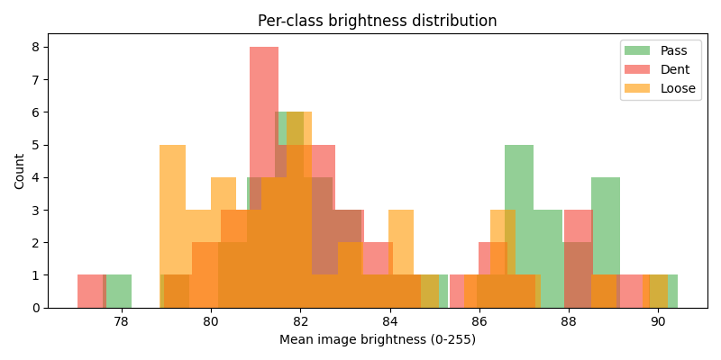
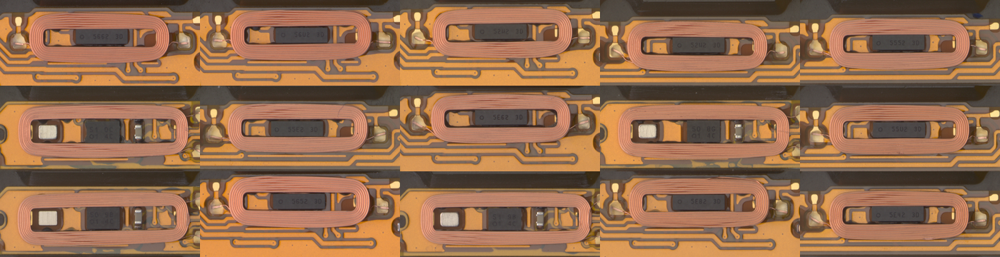

# EDA Report — Coil Defect Dataset

## Class Distribution

| Class | Count | % |
|---|---|---|
| Pass | 633 | 77.5% |
| Dent | 74 | 9.1% |
| Loose | 110 | 13.5% |
| **Total** | **817** | 100% |

## Image Properties

- Size: 2448 x 2048 px
- Mode: RGB
- Crop box: x=[300,2000]  y=[620,1320]
- Crop size: 1700 x 700 px

## Per-Class Brightness (mean gray value, full image)

- **Pass**: mean=84.2  std=3.2  min=77.6  max=90.4  (n=40)
- **Dent**: mean=83.0  std=2.9  min=77.0  max=89.8  (n=40)
- **Loose**: mean=82.5  std=2.8  min=78.9  max=90.2  (n=40)

## Flagged Images

None — all sampled images are within normal brightness range.

## Session Distribution (top 10 sessions by image count)

| Session | Total | Pass | Dent | Loose |
|---|---|---|---|---|
| 251014_150205 | 97 | 97 | 0 | 0 |
| 250825_174651 | 96 | 96 | 0 | 0 |
| 250930_172059 | 89 | 89 | 0 | 0 |
| 251003_150040 | 86 | 86 | 0 | 0 |
| 251016_150942 | 81 | 81 | 0 | 0 |
| 250907_151900 | 68 | 68 | 0 | 0 |
| 250907_154203 | 51 | 51 | 0 | 0 |
| 250930_170029 | 39 | 26 | 0 | 13 |
| 250825_152739 | 26 | 12 | 0 | 14 |
| 251003_130559 | 23 | 15 | 0 | 8 |

Total unique sessions: **28**

## Sample Crops (5 per class)

